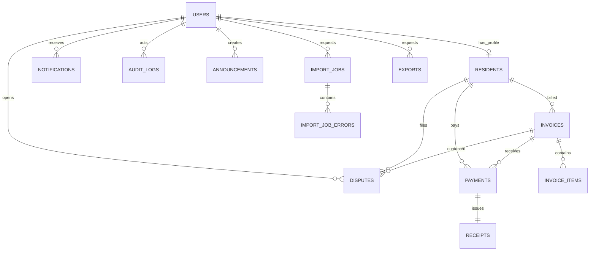

# Database Dependency Diagram

## Relationship Notes

- `users` is the identity root for staff and residents.
- `residents` is a 1:1 extension of `users` for tenancy details.
- `invoices` are 1:N to `invoice_items` and 1:N to `payments`.
- `receipts` enforce a strict 1:1 with `payments` using a unique foreign key.
- `disputes` bind a resident + invoice + opening user for clear accountability.
- `import_job_errors` depends on `import_jobs` and cascades on delete.

## Recommended Constraints / Optimizations

1. Add `CHECK (due_date >= issue_date)` on `invoices`.
2. Add `CHECK (amount > 0)` for `payments` and monetary checks for all amount columns.
3. Add partial index on `notifications (user_id) WHERE read_at IS NULL` for unread queries.
4. Add generated column/index for normalized email in `users` if case-insensitive lookups are frequent.
5. Consider table partitioning by month/year for `audit_logs` at scale.
